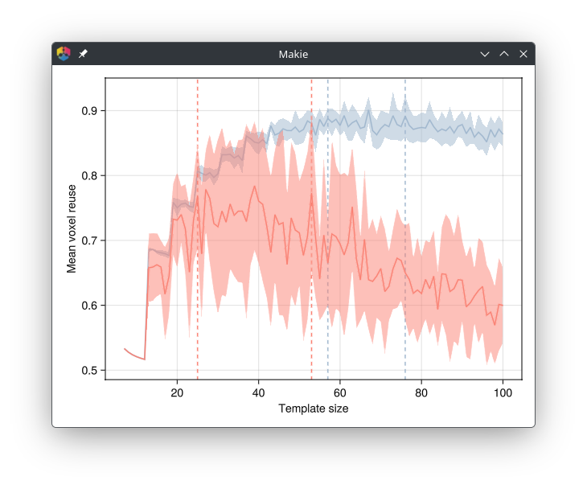

## Helper function

A helper function is provided for the fast approximation of the *mean voxel reuse*:

```@docs
voxelreuse
```

## Plot recipe

A plot recipe is provided for tile design in image quilting:

```@docs
voxelreuseplot
```

In order to plot the voxel reuse of a training image, install any of the
[Makie.jl](https://docs.makie.org) backends.

```julia
] add CairoMakie
```

The example below uses training images from the
[GeoStatsImages.jl](https://github.com/JuliaEarth/GeoStatsImages.jl) package:

```julia
using ImageQuilting
using GeoStatsImages
import GLMakie

img1 = geostatsimage("Strebelle")
img2 = geostatsimage("StoneWall")

rawimg1 = reshape(img1.code, size(img1.geometry))
rawimg2 = reshape(img2.value, size(img2.geometry))

voxelreuseplot(rawimg1)
voxelreuseplot!(rawimg2, color="salmon")
```

